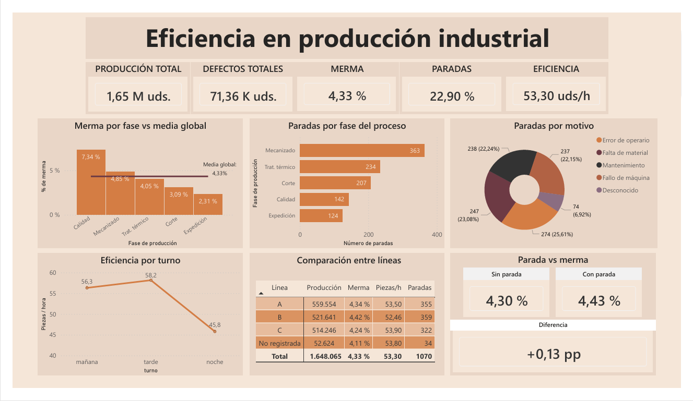

# 📊 Industrial Production Analysis

Data analysis project focused on optimizing an industrial production line for metal parts, in a context similar to the automotive sector.

The goal is to identify operational inefficiencies, analyze waste, study production stoppages, and propose data-driven improvement recommendations.

---

## 🚀 Project Overview

This project simulates a real-world data analysis case in an industrial factory.

Starting from an initially messy dataset, the project follows a complete data workflow:

1. Business problem definition  
2. Creation of a simulated dataset with realistic errors  
3. Data cleaning and validation using SQL  
4. Exploratory data analysis  
5. DAX measure modeling in Power BI  
6. Interactive dashboard development  
7. Business insights and recommendations  

The final result is a Power BI dashboard that helps identify critical production stages, compare shifts, analyze production lines, and prioritize improvement actions.

---

## 🧠 Business Question

> How can we improve production efficiency by reducing stoppages and waste across the different stages of the process?

---

## 🏭 Context

The production process analyzed is composed of five stages:

- Cutting
- Machining
- Heat treatment
- Quality control
- Dispatch

Each stage may present issues related to:

- defects or waste
- production stoppages
- efficiency losses
- shift differences
- production line differences

---

## 📂 Repository Structure

```text
Industrial-production/
│
├── data/
│   ├── dataset_produccion_industrial_raw.csv
│   ├── dataset_produccion_clean.csv
│   └── data-quality.md
│
├── docs/
│   ├── notebook.md
│   └── ia.md
│
├── power-bi/
│   ├── dashboard.png
│   ├── dashboard-preview.png
│   └── interactive-dashboard.md
│
└── README.md
```

---

## 📁 Main Files

| File | Description |
|---|---|
| [`data/dataset_produccion_industrial_raw.csv`](data/dataset_produccion_industrial_raw.csv) | Original simulated dataset with intentional errors |
| [`data/dataset_produccion_clean.csv`](data/dataset_produccion_clean.csv) | Clean dataset prepared for analysis |
| [`data/data-quality.md`](data/data-quality.md) | Summary of data quality issues and cleaning decisions |
| [`docs/notebook.md`](docs/notebook.md) | Full technical notebook with the complete workflow |
| [`docs/ia.md`](docs/ia.md) | Explanation of how AI was used in the project |
| [`power-bi/dashboard.png`](power-bi/dashboard.png) | Final dashboard screenshot |
| [`power-bi/dashboard-preview.png`](power-bi/dashboard-preview.png) | Dashboard preview |
| [`power-bi/interactive-dashboard.md`](power-bi/interactive-dashboard.md) | Information about the interactive Power BI dashboard |

---

## 🛠️ Tools Used

- PostgreSQL
- pgAdmin4
- SQL
- Excel
- Power BI Desktop
- Power Query
- DAX
- GitHub
- Generative AI as support

---

## 📊 Dataset

The dataset was simulated to represent a realistic industrial production environment.

It was intentionally designed with errors in order to work through a full cleaning and validation process.

### Main Variables

| Group | Variables |
|---|---|
| Identification | `id_registro`, `fecha`, `operario_id` |
| Production | `unidades_producidas`, `unidades_defectuosas` |
| Process | `fase`, `turno`, `linea_produccion` |
| Time | `tiempo_produccion_min`, `tiempo_parada_min` |
| Stoppages | `hubo_parada`, `motivo_parada` |

### Issues Included in the Raw Dataset

- missing values
- typos
- dates in different formats
- inconsistent categories
- non-standard boolean values
- defective units greater than produced units
- out-of-range time values
- stoppages without a recorded reason

---

## 🧹 Data Cleaning

Data cleaning was performed in PostgreSQL using a two-step strategy:

1. Import the data into a raw table with all fields stored as text.
2. Create a clean table with correct data types and validation rules.

### Main Cleaning Decisions

| Issue Detected | Decision Applied |
|---|---|
| Invalid data | Converted to `NULL` |
| Defective units > produced units | Converted to `NULL` |
| Unrealistic time values | Converted to `NULL` |
| Stoppage without reason | Labeled as `desconocido` |
| Missing production line | Labeled as `No registrada` |
| Partially valid records | Kept to avoid losing useful information |

Data quality was prioritized over completeness. Instead of removing every record with an issue, the project kept partially valid records and only invalid values were transformed into `NULL`.

---

## ✅ Cleaning Results

| Metric | Result |
|---|---:|
| Initial records | 5,201 |
| Final clean records | 4,673 |
| Nulls in critical variables | 0 |
| Stoppages without reason after cleaning | 0 |
| Logical inconsistencies | 0 |

The final dataset was validated and prepared for Power BI analysis.

---

## 📈 Main KPIs

| KPI | Result |
|---|---:|
| Total production | 1.65 M units |
| Total defects | 71.36 K units |
| Global waste rate | 4.33% |
| Records with stoppage | 22.90% |
| Efficiency | 53.30 units/hour |

---

## 📊 Power BI Dashboard

The final dashboard was designed to quickly communicate the main problems in the production process.



### Dashboard Structure

#### Top Section

Main KPIs:

- total production
- total defects
- waste rate
- stoppages
- efficiency

#### Middle Section

Main analysis:

- waste by production stage vs global average
- stoppages by production stage
- stoppages by reason

#### Bottom Section

Operational comparison:

- efficiency by shift
- comparison between production lines
- stoppage vs waste

---

## 📌 Visualizations Used

| Analysis | Visualization |
|---|---|
| Main KPIs | Cards |
| Waste by stage vs global average | Combo chart: columns and line |
| Stoppages by stage | Horizontal bar chart |
| Stoppages by reason | Donut chart |
| Efficiency by shift | Line chart |
| Production line comparison | Matrix |
| Stoppage vs waste | Comparative cards |

Different visual types were used to avoid a repetitive dashboard and improve executive readability.

---

## 🧮 Main DAX Measures

```DAX
Produccion Total =
SUM(produccion_tabla_clean[unidades_producidas])
```

```DAX
Defectos Totales =
SUM(produccion_tabla_clean[unidades_defectuosas])
```

```DAX
Unidades Validas =
[Produccion Total] - [Defectos Totales]
```

```DAX
Tiempo Total Min =
SUM(produccion_tabla_clean[tiempo_produccion_min])
+ SUM(produccion_tabla_clean[tiempo_parada_min])
```

```DAX
% Merma =
DIVIDE([Defectos Totales], [Produccion Total], 0)
```

```DAX
Total Paradas =
CALCULATE(
    COUNTROWS(produccion_tabla_clean),
    produccion_tabla_clean[hubo_parada] = TRUE()
)
```

```DAX
% Paradas =
DIVIDE(
    [Total Paradas],
    COUNTROWS(produccion_tabla_clean),
    0
)
```

```DAX
Eficiencia =
DIVIDE([Unidades Validas], [Tiempo Total Min], 0)
```

```DAX
Eficiencia Hora =
[Eficiencia] * 60
```

Efficiency was converted from units per minute to units per hour to make the KPI easier to interpret from a business perspective.

---

## 🧱 Supporting DAX Columns and Tables

Some calculated columns and auxiliary tables were created to improve dashboard readability.

### Short Stage Name

```DAX
Fase Corta =
SWITCH(
    produccion_tabla_clean[fase],
    "control_calidad", "Calidad",
    "tratamiento_termico", "Trat. térmico",
    "mecanizado", "Mecanizado",
    "corte", "Corte",
    "expedicion", "Expedición",
    produccion_tabla_clean[fase]
)
```

### Clean Stoppage Reason

```DAX
Motivo Parada Limpio =
SWITCH(
    produccion_tabla_clean[motivo_parada],
    "error_operario", "Error de operario",
    "fallo_maquina", "Fallo de máquina",
    "falta_material", "Falta de material",
    "mantenimiento", "Mantenimiento",
    "desconocido", "Desconocido",
    produccion_tabla_clean[motivo_parada]
)
```

### Clean Production Line

```DAX
Linea Produccion Limpia =
VAR Linea = TRIM(produccion_tabla_clean[linea_produccion])
RETURN
IF(
    ISBLANK(Linea) || Linea = "",
    "No registrada",
    Linea
)
```

### Shift Dimension Table

A small dimension table was created to correctly order shifts in the line chart.

```DAX
Dim Turno =
DATATABLE(
    "turno", STRING,
    "orden_turno", INTEGER,
    {
        {"mañana", 1},
        {"tarde", 2},
        {"noche", 3}
    }
)
```

This table was related to the main table using:

```text
Dim Turno[turno] → produccion_tabla_clean[turno]
```

Relationship type:

```text
One-to-many (1:*)
```

---

## 🔍 Key Insights

### 1. Quality control concentrates the highest waste rate

The stage with the highest waste rate is **quality control**, with **7.34%**, above the global average of **4.33%**.

This indicates that defects are detected at this stage, but they are not necessarily generated there. Quality control may act as the detection point, while the root cause could be located in previous stages such as machining or heat treatment.

---

### 2. Machining is the most critical stage for stoppages

The **machining** stage concentrates the highest number of stoppages, with **363 interruptions**.

This makes it a priority stage from an operational perspective. A high number of stoppages can affect production flow, increase downtime, and reduce process stability.

---

### 3. Stoppage causes are multifactorial

The main stoppage reason is **operator error**, but the causes are distributed across several categories:

- human errors
- material shortages
- maintenance
- machine failures
- unknown reasons

This indicates that there is no single root cause behind the problem. The stoppages are related to human, technical, logistical, and data quality factors.

---

### 4. The night shift has lower efficiency

The night shift does not show a much higher waste rate than the other shifts, but it does show lower efficiency.

The issue seems to be more related to operational performance than to quality. In other words, the night shift produces fewer valid units per hour.

---

### 5. Production line B requires priority attention

Line B combines:

- highest waste rate
- lowest efficiency
- highest number of stoppages

Therefore, it should be prioritized for an operational review. Although the differences between lines are not extreme, line B has the weakest overall balance.

---

### 6. Stoppages are associated with slightly higher waste

Records with a stoppage show a waste rate of **4.43%**, compared to **4.30%** for records without a stoppage.

The difference is not very high, but it suggests that interruptions may affect process stability and slightly increase waste.

---

## 💡 Special Interactive Insight

When using the dashboard interactively, some patterns change when filtering by stage.

Globally, the most efficient shift is the afternoon shift. However, when filtering by **Heat treatment**, the morning shift becomes the most efficient.

Approximate efficiency values for Heat treatment:

| Shift | Efficiency |
|---|---:|
| Morning | 53.3 units/hour |
| Afternoon | 50.1 units/hour |
| Night | 40.2 units/hour |

This shows that decisions should not be based only on global indicators. It is necessary to analyze intersections between:

- stage
- shift
- production line
- stoppages
- efficiency

The dashboard is not only useful for showing overall KPIs, but also for exploring hidden patterns through filters.

---

## 🚀 Business Recommendations

### Priority 1: Review machining

Machining concentrates the highest number of stoppages and may be related to defects detected later in the process.

Recommended actions:

- review machinery
- analyze stoppage causes
- check preventive maintenance
- identify whether stoppages are concentrated in specific machines, shifts, or operators
- study whether stoppages coincide with increases in waste

---

### Priority 2: Investigate the real origin of defects

Quality control detects the highest waste rate, but the origin may be located in previous stages.

Recommended actions:

- classify defect types
- trace defects back to previous stages
- review machining and heat treatment
- introduce intermediate quality checks
- analyze defects by stage, shift, and production line

---

### Priority 3: Analyze production line B

Line B combines worse quality, lower efficiency, and more stoppages.

Recommended actions:

- compare line B with lines A and C
- review machinery and procedures
- analyze assigned shifts
- check whether it works with different loads or materials
- carry out a specific operational audit for line B

---

### Priority 4: Review the night shift

The night shift shows lower operational efficiency.

Recommended actions:

- review workload
- analyze staff availability
- check maintenance support
- study response times to incidents
- compare procedures with morning and afternoon shifts

---

### Priority 5: Improve stoppage reason recording

The `desconocido` category indicates a limitation in data capture.

Recommended actions:

- make stoppage reason recording mandatory
- create a closed list of reasons
- reduce ambiguous free-text fields
- train staff on incident logging
- periodically review incomplete records

---

### Priority 6: Analyze stage-shift combinations

The interactive dashboard showed that patterns can change depending on the selected stage.

Recommended actions:

- analyze efficiency by stage and shift
- identify the best-performing shift for each stage
- compare best practices between shifts
- avoid applying general solutions without validating stage-level behavior

---

## 🧠 Conclusion

The analysis shows that production efficiency does not depend on a single factor.

The problem is multifactorial and combines:

- quality
- stoppages
- shifts
- production lines
- data capture

The dashboard makes it possible to move from messy data to concrete decisions, identifying where to act first and which actions could have the greatest impact.

The main operational priorities are:

1. Review machining.
2. Investigate the real source of defects detected in quality control.
3. Analyze production line B.
4. Review the night shift.
5. Improve stoppage reason recording.
6. Analyze intersections between stage and shift.

---

## 🤖 Use of AI in the Project

AI was used as a support tool in different phases of the project:

- simulated dataset generation
- creation of intentional data errors
- support in cleaning strategies
- review of SQL approaches
- analysis structuring
- documentation improvement

AI did not replace the analysis. The important decisions were manually reviewed and adapted to the project context.

More details in [`docs/ia.md`](docs/ia.md).

---

## 📚 Additional Documentation

- [Full technical notebook](docs/notebook.md)
- [Use of AI in the project](docs/ia.md)
- [Data quality](data/data-quality.md)
- [Interactive dashboard](power-bi/interactive-dashboard.md)

---

## 📌 Project Status

Completed project.

Includes:

- raw dataset
- clean dataset
- documented cleaning and validation process
- exploratory analysis
- DAX modeling
- Power BI dashboard
- business insights
- actionable recommendations

---

## 👤 Author

**Ana Moya**  
Portfolio project for a **Data Analyst / Junior Data Analyst** profile.
